# FactoryDashboard

Kümes (broiler/tavuk çiftliği) işletmeleri için geliştirilmiş, gerçek zamanlı SCADA panosu, sensör takibi, alarm yönetimi ve PLC entegrasyonu sunan tam kapsamlı bir otomasyon ve izleme platformu.

## Proje Hakkında

FactoryDashboard, kümes içindeki sıcaklık, nem, yem/su tüketimi gibi kritik parametreleri Siemens S7 PLC'lerden gerçek zamanlı olarak okuyan, bu verileri işleyen ve operatörlere anlık görünürlük sağlayan bir yönetim panelidir. Sistem; sensör verilerini, alarmları, görev atamalarını ve sürü (flock) yönetimini tek bir arayüzde birleştirir.

## Özellikler

- 🖥️ **SCADA Paneli** — Kümeslerdeki sensörlerden gelen verilerin gerçek zamanlı izlenmesi
- 🔌 **PLC Entegrasyonu** — S7.Net kütüphanesi ile Siemens PLC'lere doğrudan bağlantı (arka planda çalışan `PlcService`)
- 🎲 **Sensör Simülasyonu** — PLC'ye bağlı olmayan sensörler için otomatik test verisi üretimi (`SensorSimulatorService`), gerçek ve simüle veri birbirine karışmaz
- 🐔 **Sürü (Flock) Yönetimi** — Kümes başına aktif sürü takibi, sürü başlangıç/bitiş, kayıp/mortalite güncellemeleri, yem-su tüketiminin sürü büyüklüğüne göre ölçeklenmesi
- 🚨 **Alarm Yönetimi** — Sensör bazlı alarm tetikleme ve takibi
- ✅ **Görev Atama** — Operatörlere görev tanımlama ve takip
- 👥 **Konum Bazlı Filtreleme** — Kullanıcıları/ekipmanları lokasyona göre filtreleme

## Teknoloji Yığını

**Backend**
- .NET 9 (ASP.NET Core Web API)
- Entity Framework Core
- Microsoft SQL Server
- S7.Net (Siemens PLC iletişimi)

**Frontend**
- Next.js / React
- Node.js 18+

## Kurulum

### Gereksinimler
- .NET 9 SDK
- Node.js (18+)
- Microsoft SQL Server
- (Opsiyonel) Siemens S7 PLC + TIA Portal — gerçek donanım testleri için

### Backend
```bash
cd FactoryDashboard/FactoryDashboard.API
dotnet restore
dotnet user-secrets set "ConnectionStrings:DefaultConnection" "<your-connection-string>"
dotnet run
```

### Frontend
```bash
cd frontend
npm install
npm run dev
```

## Proje Yapısı

```
FactoryDashboard/
├── FactoryDashboard.API/     # .NET backend (Controllers, Services, Repositories)
├── frontend/                 # Next.js frontend
└── images/                   # Ekran görüntüleri
```

## Ekran Görüntüleri

### Dashboard
Kümes bazlı sensör özetleri, alarm durumundaki ve veri alınamayan sensörlerin anlık listesi.

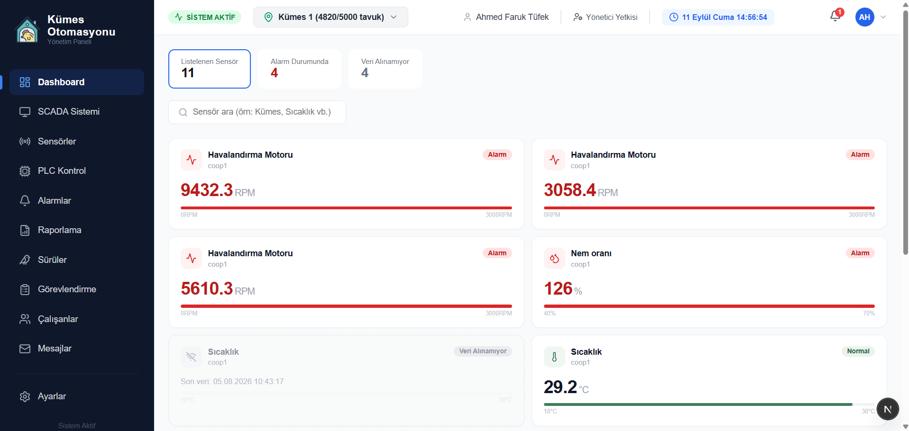

### SCADA Sistemi
Çiftlik yerleşim ve akış şeması üzerinden gerçek zamanlı sensör (sıcaklık, nem, su/yem seviyesi, havalandırma motoru RPM) izleme ve PLC etiket tanımlama.

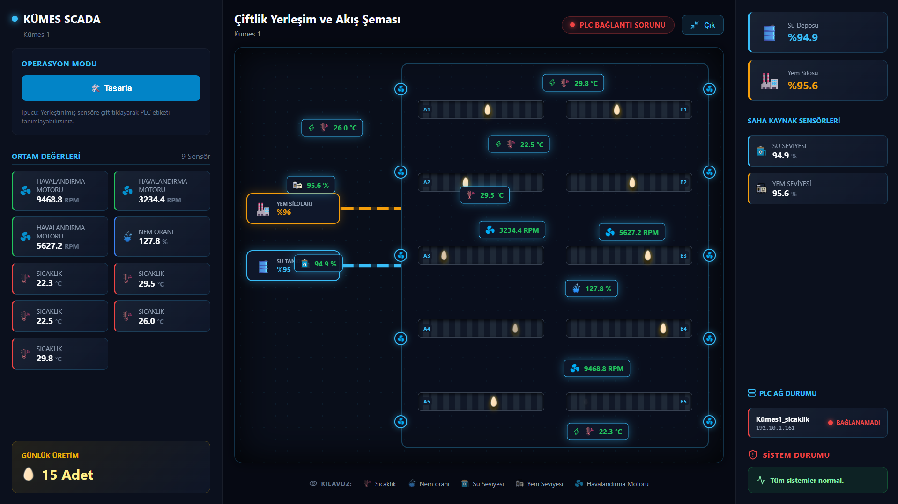
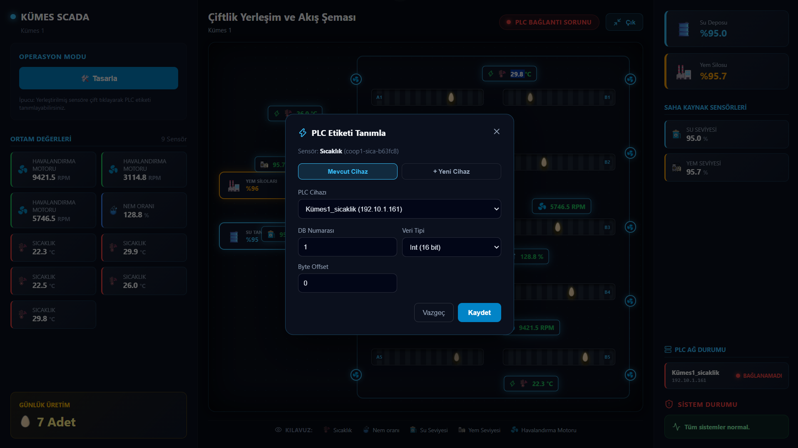

### Sensörler
Her sensöre ait geçmiş grafik, alarm durumu ve tarih aralığına göre raporlama (excel formatında).

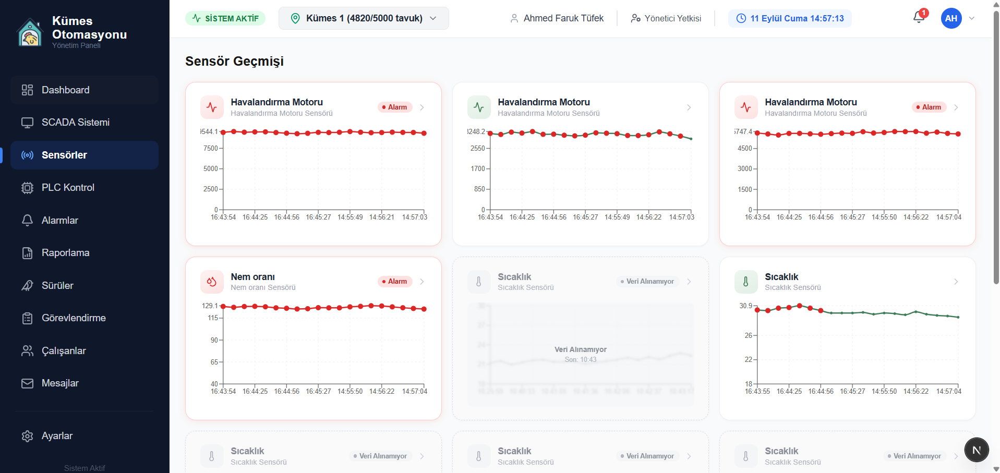
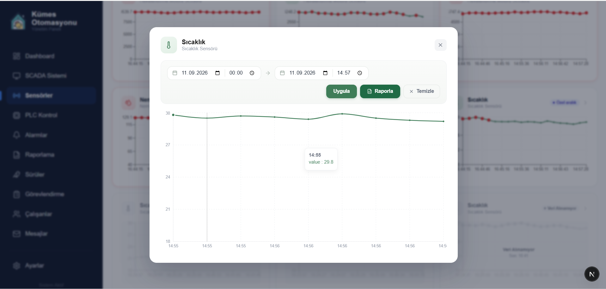

### Alarmlar
Eşik aşımı, arıza gibi sistem alarmlarının anlık listesi.

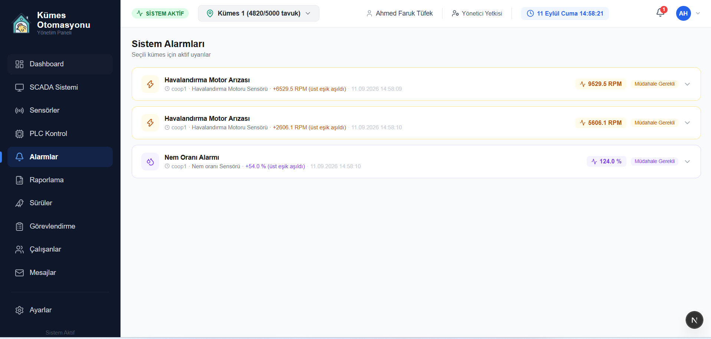

### PLC Kontrol
Siemens PLC cihazlarının bağlantı durumu, yeni cihaz/veri noktası (DB, Rack, Slot, Byte Offset) tanımlama ve gerçek donanım üzerinde test.

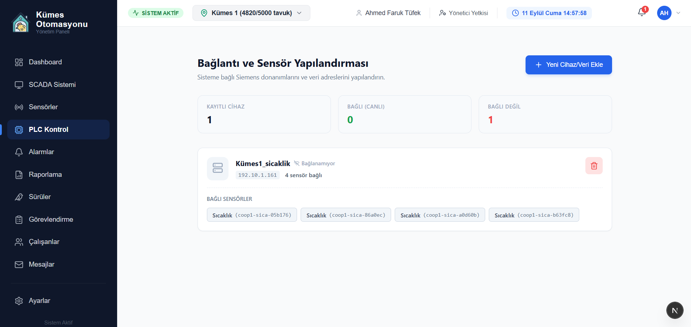
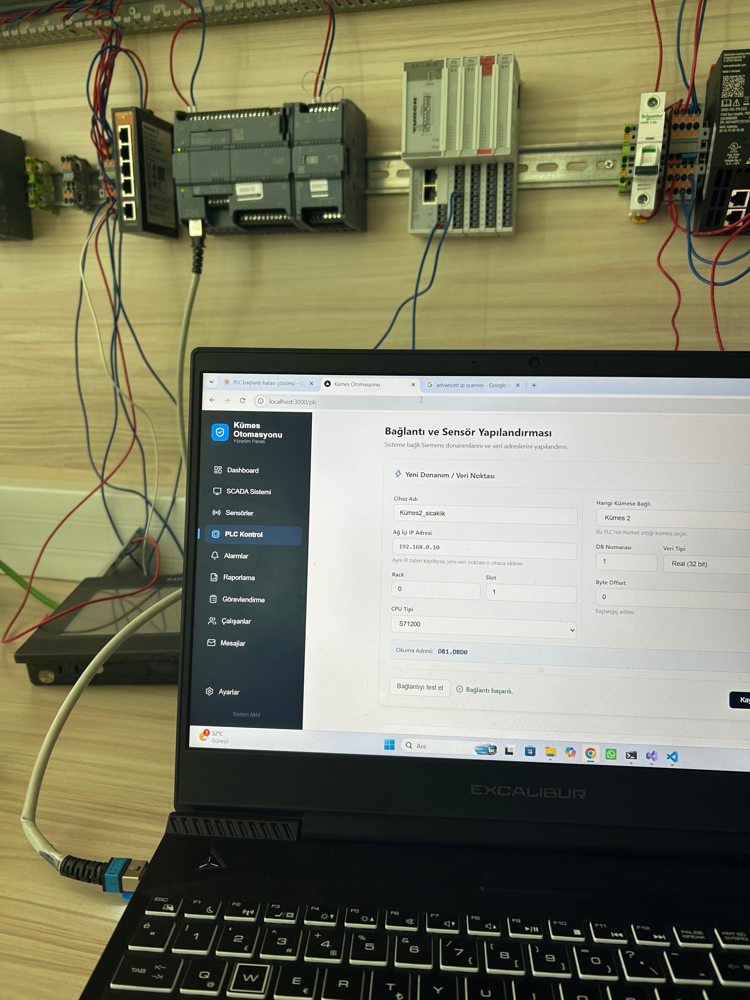

### Sürüler
Kümes başına aktif sürü durumu, ırk, gün, mevcut/başlangıç sayısı ve kayıp oranı takibi.

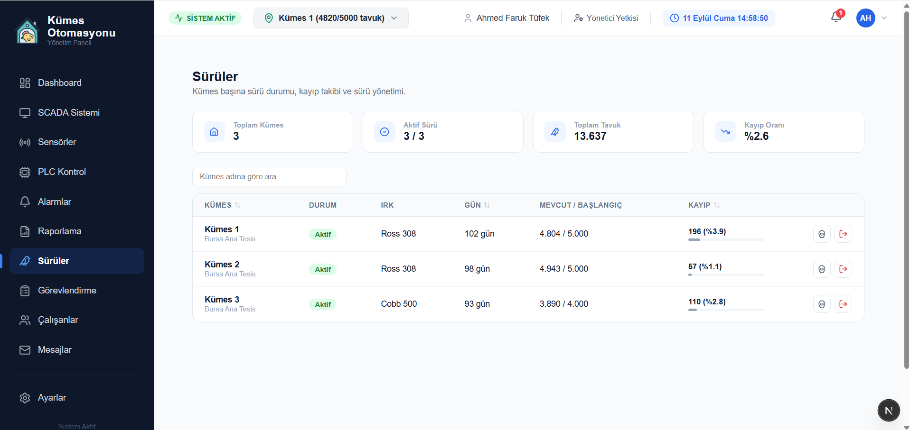

### Görevlendirme
Alarmlardan personele saha görevi, toplantı veya duyuru şeklinde görev/bildirim atama.

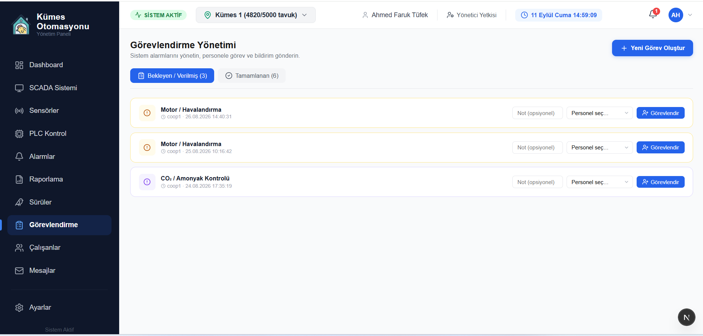
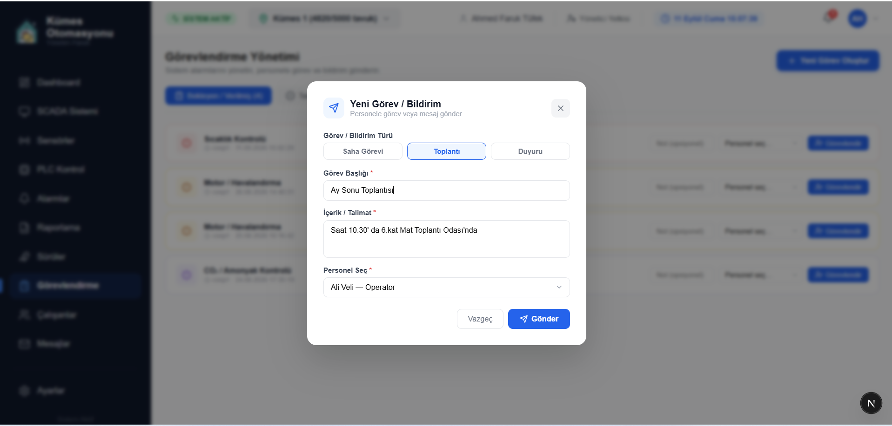

### Raporlama
Su/yem seviyesi, günlük üretim, işlem geçmişi ve alarm raporlarının tek ekranda özeti.

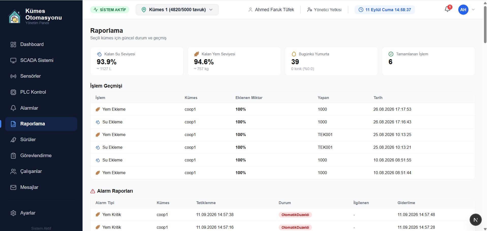

### Çalışanlar
Rol bazlı (Yönetici, Teknisyen, Operatör) çalışan yönetimi ve konum ataması.

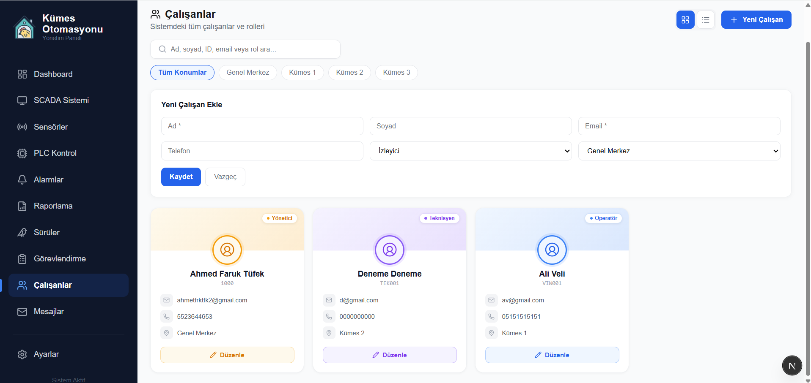

### Mesajlar
Sistem kaynaklı (PLC bağlantı sorunu, sensör arızası) bildirimler ve kullanıcılar arası mesajlaşma.

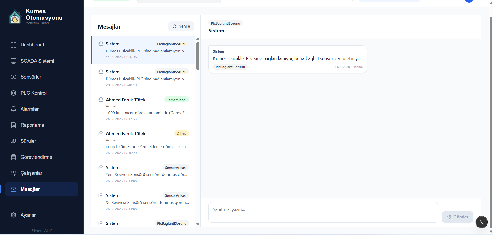

### Ayarlar
Kullanıcı profil bilgileri ve hesap tercihleri.

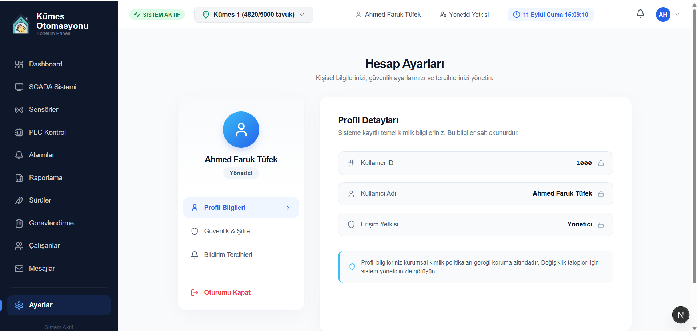

## Yol Haritası

- [ ] "Sürüler" sayfasının sidebar'a eklenmesi (SCADA ekranından bağımsız, sürü yönetimine özel sayfa)
- [ ] Alarm/olay geçmişi için Reports (raporlama) modülünün uçtan uca devreye alınması

## Lisans

Bu proje kişisel portföy/demo amaçlı geliştirilmiştir.
